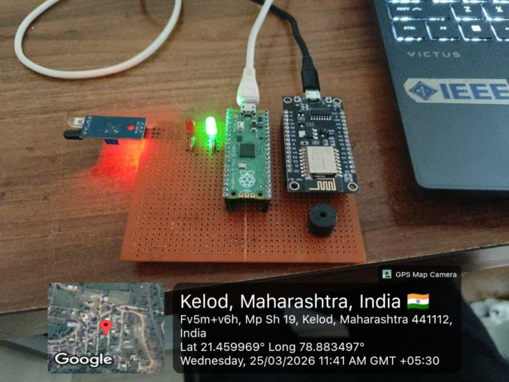
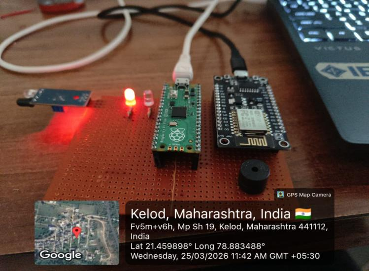
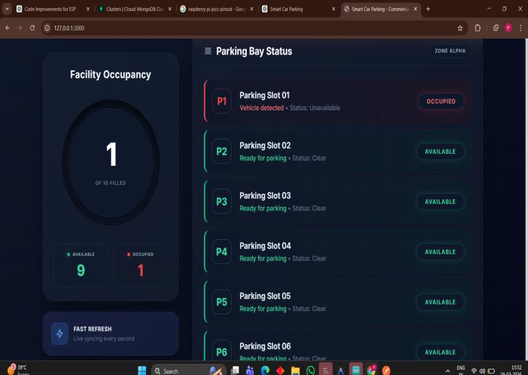
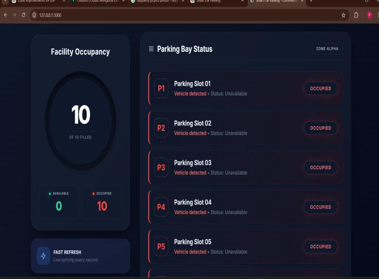
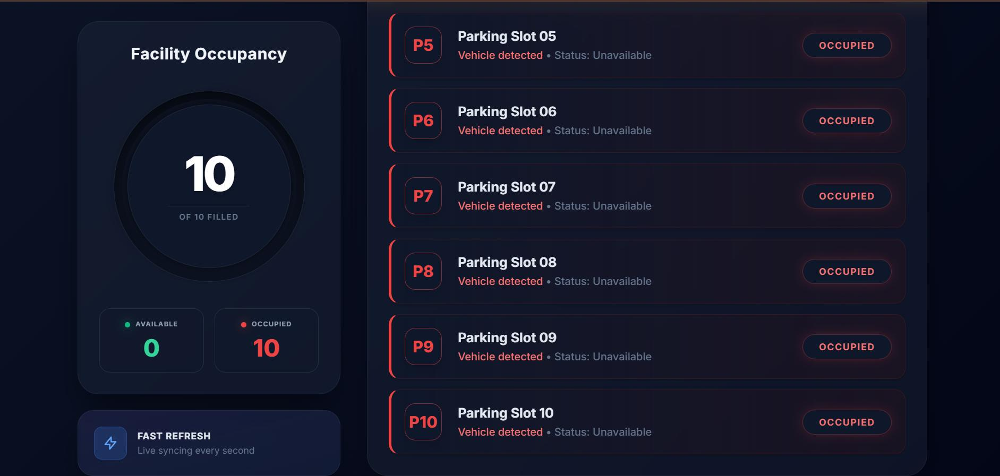
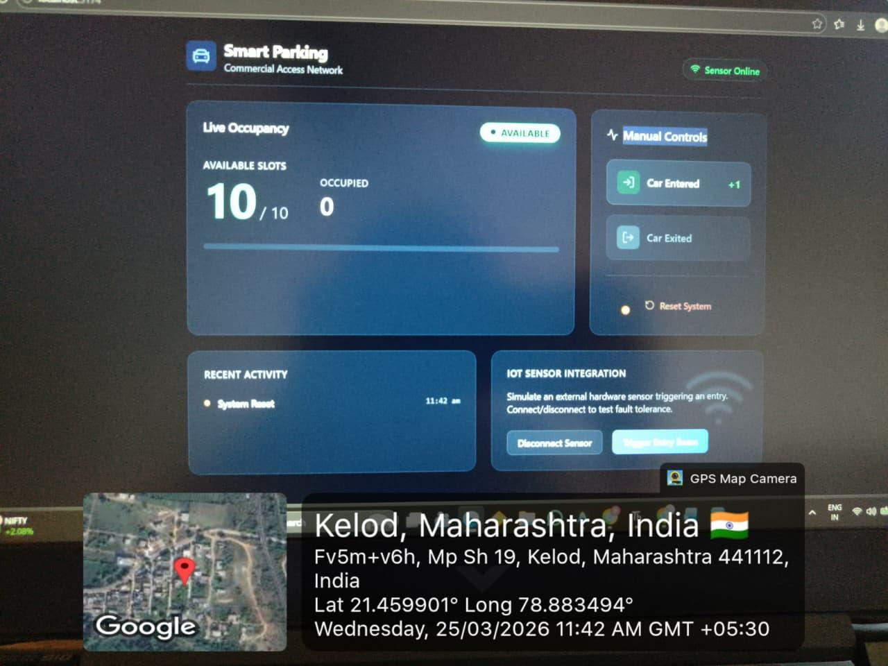
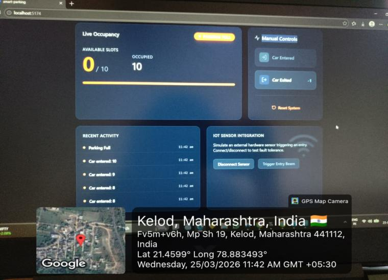
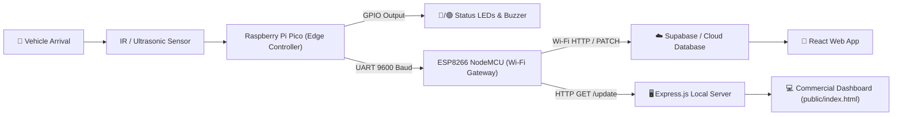

# 🚗 IoT Smart Parking System

<p align="center">
  
  
  
  
  
</p>

---

## 📌 Project Overview

The **IoT Smart Parking System** is an end-to-end intelligent parking management platform engineered to eliminate parking congestion, optimize bay utilization, and provide drivers and administrators with real-time slot availability.

Built as part of the **IoT and Network Protocols (N-MDMIT601T)** course at **S. B. Jain Institute of Technology, Management and Research, Nagpur**, the project integrates physical vehicle sensing, dual-microcontroller inter-chip communication, cloud database synchronization, and modern glassmorphic web dashboards.

### 👥 Project Team (Group 7)
* **Paras** — [GitHub: @paras999000](https://github.com/paras999000) (USN: `CS23105`)
* **Himanshu Makhe** (USN: `CS23070`)
* **Gaurav Hawelikar** (USN: `CS23026`)
* **Department:** Electronics & Telecommunication Engineering (ETC)

---

## 📸 Real Project Implementation & Gallery

### 1. Hardware Prototype & Physical Circuit Testing

| Available Status (Green LED ON) | Full Capacity Alert (Red LED + Buzzer ON) |
| :---: | :---: |
|  |  |
| *Raspberry Pi Pico + ESP8266 circuit on breadboard showing vacant slot indication.* | *System triggered at maximum capacity (10/10 slots), engaging Red LED and warning buzzer.* |

### 2. Edge Firmware Execution (MicroPython on Thonny IDE)

<p align="center">
  
  <br/>
  <em>MicroPython execution terminal showing edge falling-edge pulse capture and vehicle counter increments (Car Entered: 3 to 8).</em>
</p>

### 3. Commercial Real-Time Web Dashboards

#### Express Web Dashboard (`http://localhost:3000`)
| Single Vehicle Parked (1/10 Filled) | Maximum Capacity (10/10 Filled) |
| :---: | :---: |
|  |  |

#### Real-Time Slot Visualizer (Zone Alpha: Bays P01 to P10)
<p align="center">
  
  <br/>
  <em>Neon-glow slot status visualization highlighting occupied bays in Red and clear bays in Green.</em>
</p>

#### Reactive Cloud Web Dashboard (Supabase Sync)
| Cloud Dashboard - All Available | Cloud Dashboard - Full Alert |
| :---: | :---: |
|  |  |

---

## 🏗️ System Architecture & Data Flow



1. **Detection:** When a vehicle enters the parking bay entrance, the optical IR / Ultrasonic beam is interrupted.
2. **Edge Processing:** The **Raspberry Pi Pico** detects the falling edge signal (`1 -> 0`), runs anti-bounce filtering, and updates the local counter.
3. **Local Feedback:** If available, the Green LED shines; once counter reaches `10`, the Red LED illuminates and an active buzzer sounds.
4. **Serial Bridge:** The Pico outputs the live counter value via UART Serial (`Pin 0 / GP0 TX` at 9600 baud).
5. **Cloud Gateway:** The **ESP8266** captures the UART payload, establishes Wi-Fi connectivity, and transmits real-time PATCH requests to Supabase and the Express server.
6. **Web Dashboard:** The responsive dashboard continuously polls and visualizes slot telemetry with live dial animations.

---

## 🔌 Hardware Pin Mapping & Wiring

| Microcontroller | Pin Label | Connected Component | Purpose |
| :--- | :--- | :--- | :--- |
| **Raspberry Pi Pico** | `GP15` | IR Sensor `OUT` | Obstacle detection / beam interruption |
| **Raspberry Pi Pico** | `GP16` | Green LED (+ 220Ω Resistor) | Visual status: Slot Available |
| **Raspberry Pi Pico** | `GP17` | Red LED (+ 220Ω Resistor) | Visual status: Parking Full |
| **Raspberry Pi Pico** | `GP18` | Active Buzzer | Audible alarm on maximum capacity |
| **Raspberry Pi Pico** | `GP14` | Push Button (`PULL_UP`) | Manual system counter reset |
| **Raspberry Pi Pico** | `GP0 (TX)` | ESP8266 `RX` | UART Serial counter data transmit |
| **Raspberry Pi Pico** | `GP1 (RX)` | ESP8266 `TX` | UART Serial feedback receive |
| **Raspberry Pi Pico** | `GND` | Common Ground Rail | Shared reference potential |
| **ESP8266 NodeMCU** | `3V3 / VIN` | Breadboard Power Rail | 3.3V / 5V DC Supply |

---

## 📂 Repository Directory Structure

```text
Smart-parking-system-iot/
├── .gitignore                          # Git ignore configuration
├── README.md                           # Project technical documentation & real images
├── package.json                        # Node.js dependencies & scripts
├── server.js                           # Express REST API server & database handler
├── data.json                           # Local JSON state store for parking counter
│
├── hardware/                           # Embedded microcontroller firmware
│   ├── pico_firmware/
│   │   └── main.py                     # MicroPython edge controller firmware
│   ├── esp8266_gateway/
│   │   └── esp8266_supabase_gateway.ino # ESP8266 Wi-Fi to Supabase gateway sketch
│   └── tft_display/
│       └── tft_parking_display.ino     # TFT animated graphic status screen sketch
│
├── public/                             # Web Frontend Application
│   └── index.html                      # Glassmorphism commercial dashboard & simulator
│
├── frontend-react/                     # React Application
│   └── SmartParkingDashboard.jsx       # Reactive Tailwind + Lucide dashboard component
│
├── images/                             # Real project execution photos & screenshots
│   ├── hardware_setup_vacant.jpeg      # Physical prototype (Vacant state)
│   ├── hardware_setup_full.jpeg        # Physical prototype (Full state)
│   ├── pico_micropython_shell.jpeg     # Thonny MicroPython shell logs
│   ├── react_dashboard_available.jpeg  # Cloud dashboard available state
│   ├── react_dashboard_full.jpeg       # Cloud dashboard full state
│   ├── express_dashboard_bay_status_1.jpeg # Bay status (1 occupied)
│   ├── express_dashboard_bay_status_full.jpeg # Bay status (all occupied)
│   └── express_dashboard_bay_status_full_slots.jpeg # Bay P5-P10 neon view
```

---

## 🚀 Getting Started

### 1. Running the Web Dashboard Locally

#### Prerequisites
* Node.js (v16.x or higher)
* npm

#### Installation & Launch
```bash
# Clone the repository
git clone https://github.com/paras999000/Smart-parking-system-iot.git
cd Smart-parking-system-iot

# Install dependencies
npm install

# Start the dashboard server
npm start
```

Open your browser at **`http://localhost:3000`** to view the live dashboard.

> 💡 **Built-in Simulation Mode:** You can test vehicle arrivals, departures, and system resets directly using the **Simulation Controls** on the dashboard without requiring hardware!

---

### 2. Microcontroller Setup

#### Flashing Raspberry Pi Pico (`hardware/pico_firmware/main.py`):
1. Install [Thonny IDE](https://thonny.org/).
2. Connect your Raspberry Pi Pico via USB while holding the `BOOTSEL` button.
3. Flash the latest MicroPython UF2 firmware.
4. Open `hardware/pico_firmware/main.py` in Thonny and save it onto the Pico as `main.py`.
5. Run the script. The shell will start reporting car entry events.

#### Flashing ESP8266 Gateway (`hardware/esp8266_gateway/esp8266_supabase_gateway.ino`):
1. Open the sketch in the **Arduino IDE**.
2. Add ESP8266 board support via Board Manager (`http://arduino.esp8266.com/stable/package_esp8266com_index.json`).
3. Enter your Wi-Fi SSID and Password in `esp8266_supabase_gateway.ino`.
4. Connect ESP8266 via USB and upload.

---

## 📡 REST API Documentation

| Endpoint | Method | Description | Example Response |
| :--- | :--- | :--- | :--- |
| `/data` | `GET` | Fetches current counter & capacity | `{"counter": 3, "max": 10}` |
| `/update?count=N` | `GET` | Updates counter value directly | `{"message": "updated", "counter": 4}` |
| `/api/entry` | `GET` | Increments occupied count by 1 | `{"status": "success", "counter": 5}` |
| `/api/exit` | `GET` | Decrements occupied count by 1 | `{"status": "success", "counter": 4}` |
| `/api/reset` | `GET` | Resets counter back to 0 | `{"status": "success", "counter": 0}` |

---

## 🎯 Key Project Outcomes

* **Automated Vehicle Tracking:** Replaced manual parking attendance with reliable optical beam sensing.
* **Low-Cost Distributed Hardware:** Utilized an affordable dual-MCU architecture (Raspberry Pi Pico + ESP8266).
* **Zero Cloud Latency Issues:** Decoupled critical local alerts (instant LED/Buzzer response on Pico) from asynchronous cloud network synchronization.
* **Universal Accessibility:** Accessible from any browser or mobile device on the local network or internet.

---

## 📜 License
This project is developed for academic and educational purposes under the **ISC License**.
